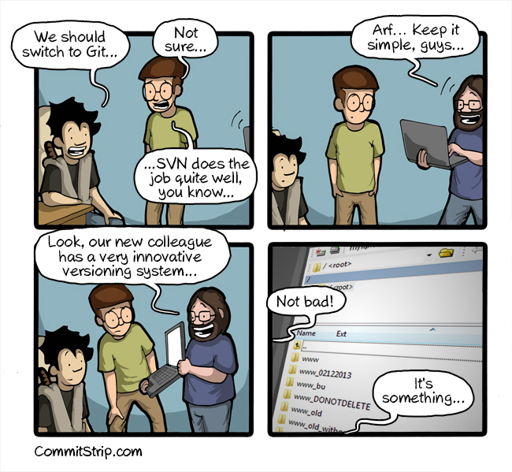

== Git, command line tool

=== Why git ?

<<<
=== Bascis

==== Let's create our first repository

Simply execute this command :

----
fabien@izanagi ~ » git init my_awesome_project
Initialized empty Git repository in /home/fabien/my_awesome_project/.git/
----

You've just create a directory named my_awesome_project containing an another folder named .git :

----
fabien@izanagi ~ » cd my_awesome_project
fabien@izanagi ~/my_awesome_project » tree -a
.
└── .git
    ├── branches
    ├── config
    ├── description
    ├── HEAD
    ├── hooks
    │   ├── applypatch-msg.sample
    │   ├── ...
    │   └── update.sample
    ├── info
    │   └── exclude
    ├── objects
    │   ├── info
    │   └── pack
    └── refs
        ├── heads
        └── tags

10 directories, 14 files
----

We'll see later what files are in the .git directory, just know git will store everything it needs in this folder.
We can check the state of our repository by executing `*git status*` :

----
fabien@izanagi ~/my_awesome_project » git status
On branch master

Initial commit

nothing to commit (create/copy files and use "git add" to track)
----

<<<
==== Our first commit

.Create a file `*app.py*` with the most useful code :
[source,python]
----
#!/usr/bin/env python2

def greetings():
    print "Hello world!"

if __name__ == "__main__":
    greetings()
----

.Let's check the state of the repository again :
----
fabien@izanagi ~/my_awesome_project » git status
On branch master

Initial commit

Untracked files: <1>
  (use "git add <file>..." to include in what will be committed)

  app.py <1>

nothing added to commit but untracked files present (use "git add" to track) <2>
----
<1> Currently, git don't care about our code as `*app.py*` has the status `*Untracked*`.
<2> Generally, git suggests some action to take.

.Currently, the file is not part of the repository. You need to tell git to take care of your code :
----
fabien@izanagi ~/my_awesome_project » git add app.py
----

.Is your file committed ? Hum ... no yet
----
fabien@izanagi ~/my_awesome_project » git status
On branch master

Initial commit

Changes to be committed:
  (use "git rm --cached <file>..." to unstage)

  new file:   app.py
----

Our file is staged. It means it'll part of our next commit. Before committing, it's always a good idea
to check repository state using `*git status*`.

.Finally, our first commit ... or not.
----
fabien@izanagi ~/my_awesome_project » git commit -m 'My first commit!'

*** Please tell me who you are. <1>

Run

  git config --global user.email "you@example.com" <1>
  git config --global user.name "Your Name"

to set your account's default identity.
Omit --global to set the identity only in this repository.

fatal: empty ident name (for <(null)>) not allowed
----
<1> The author name and email are part of the commit. Git requires them and suggests one more time
action to take to solve the current issue.

Telling who you are can it be done in multiple ways :

.By command lines
----
fabien@izanagi ~/my_awesome_project » git config --global user.email "fabien.engels@unistra.fr"
fabien@izanagi ~/my_awesome_project » git config --global user.name "Fabien Engels"
----

.Or directly creating a config file named `*~/.gitconfig*` :
[source,ini]
----
[user]
  email = fabien.engels@unistra.fr
  name = Fabien Engels
----

.Let's try to commit again
----
fabien@izanagi ~/my_awesome_project » git commit -m 'My first commit!'
[master (root-commit) 64188b7] My first commit!
 1 file changed, 8 insertions(+)
 create mode 100755 app.py
----

.It worked, you've done your first commit !
----
fabien@izanagi ~/my_awesome_project » git log
commit 64188b75074257c639920a2a45e00130aea7219f
Author: Fabien Engels <fabien.engels@unistra.fr>
Date:   Tue Feb 28 09:34:14 2017 +0100

    My first commit!
----

<<<
==== A first look to .git directory

.Our commit created multiple object files inside .git directory.
----
fabien@izanagi ~/my_awesome_project » find .git/objects -type f
.git/objects/88/cdc3534dd04abe83564c4f4dd4ac8e5b0d41de
.git/objects/64/188b75074257c639920a2a45e00130aea7219f <1>
.git/objects/a6/1f1b413ea15b1dc692cc7e55b6f060edf268e3
----
<1> Our commit

.Display object corresponding to our commit
----
fabien@izanagi ~/my_awesome_project » git cat-file -p 64188b
tree a61f1b413ea15b1dc692cc7e55b6f060edf268e3 <1>
author Fabien Engels <fabien.engels@unistra.fr> 1488270854 +0100
committer Fabien Engels <fabien.engels@unistra.fr> 1488270854 +0100

My first commit!
----
<1> Reference to another object !

.What inside in this other object
----
fabien@izanagi ~/my_awesome_project » git cat-file -p a61f1b
100755 blob 88cdc3534dd04abe83564c4f4dd4ac8e5b0d41de  app.py <1>
----
<1> Reference to a blob object !

.Have a look to this blob object ... it's our code !
----
fabien@izanagi ~/my_awesome_project » git cat-file -p 88cdc3
#!/usr/bin/env python2

def greetings():
    print "Hello world!"

if __name__ == "__main__":
    greetings()
----

[NOTE]
You can shorten IDs until there is no ambiguity.
ex: ID a61f1b413ea15b1dc692cc7e55b6f060edf268e3 can be shorten as a61f1b

[NOTE]
Git store snapshots of your code, not differences like SVN. It's one
of the reason Git is so fast (but use more space).

<<<
==== Improve our code

.Have a look to this blob object ... it's our code !
[source,python]
----
#!/usr/bin/env python2

def greetings():
    print "Hello RESIF people!"

if __name__ == "__main__":
    greetings()
----

.You can visualize your current modifications between your workdir and repository head :
----
fabien@izanagi Sync/my_awesome_project » git diff
diff --git a/app.py b/app.py
index 88cdc35..e35169d 100755
--- a/app.py
+++ b/app.py
@@ -1,7 +1,7 @@
 #!/usr/bin/env python2

 def greetings():
-    print "Hello world!"
+    print "Hello RESIF people!"

 if __name__ == "__main__":
----

.Of course in order to commit your change, you need to stage your file and then commit it
----
fabien@izanagi ~/my_awesome_project » git add app.py
fabien@izanagi ~/my_awesome_project » git status
On branch master
Changes to be committed:
  (use "git reset HEAD <file>..." to unstage)

  modified:   app.py
fabien@izanagi ~/my_awesome_project » git commit -m 'What an improvement!'
[master b6cb2cc] What an improvement!
 1 file changed, 1 insertion(+), 1 deletion(-)
fabien@izanagi ~/my_awesome_project (master) » git log
commit b6cb2cc4a5034ae5a5bf35830cdec761cb2d6f1d
Author: Fabien Engels <fabien.engels@gmail.com>
Date:   Thu Mar 2 14:45:25 2017 +0100

    What an improvement!

commit 64188b75074257c639920a2a45e00130aea7219f
Author: Fabien Engels <fabien.engels@unistra.fr>
Date:   Tue Feb 28 09:34:14 2017 +0100

    My first commit!
----

We're done with the basics, the next chapter will explain how to collaborate !
