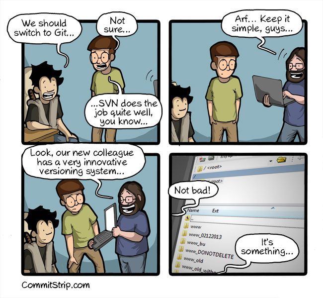

<<<
== Introduction

=== Tracking your code

=== Why using over SVN ?

- Branches are cheap
- Fast, store whole files not differences
- Not centralized (DVCS vs VCS)
- Work offline (commit offline and push when online)

<<<
=== Sharing your code

.Some projects hosted by GitHub
[cols="20%,20%,12%,48%", options="header]
|===
|Project name
|Collaborators
|Commits
|Home

|Python
|182
|> 98k
|https://github.com/python/cpython

|Linux
|∞
|> 662k
|https://github.com/torvalds/linux

|Django
|1377
|> 24k
|https://github.com/django/django

|Homebrew
|6307
|> 79k
|https://github.com/Homebrew/homebrew-core

|===

.Seismology related projects
[cols="20%,20%,12%,48%", options="header]
|===
|Project name
|Collaborators
|Commits
|Home

|Obspy
|63
|> 10k
|https://github.com/obspy/obspy

|SeisComP3
|20
|> 500
|https://github.com/SeisComP3/seiscomp3

|MSNoise
|4
|> 400
|https://github.com/ROBelgium/MSNoise

|libmseed
|3
|> 110
|https://github.com/iris-edu/libmseed

|ringserver
|2
|> 118
|https://github.com/iris-edu/ringserver

|waveloc
|1
|> 560
|https://github.com/amaggi/waveloc

|wphase
|3
|> 246
|https://github.com/eost/wphase

|seedscan
|6
|> 908
|https://github.com/usgs/seedscan

|StationXML
|3
|> 10
|https://github.com/FDSN/StationXML

|===

[NOTE]
====
.Some stats from 2016, GitHub had :
- 5.8M active users
- 331k organizations
- 19.4M active repositories
- 10.7M active issues
====

<<<
=== A bit of history

- Created by Linus Torvalds
- ... to replace BitKeeper
- Released on 11th July 2005

[NOTE]
.Google searches from 2005 to 2017
====
image::images/google-searches.svg[]
====
